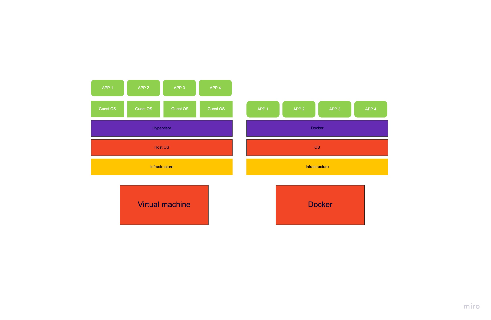

# Docker

The Docker technology is a tool that simplifies the process of building and containerizing your applications, putting together source code, OS libraries and dependencies specific for the project in question avoiding redundant functionality.

Docker is therefore a great way for any organization to set up a controlled environment for development of an application. It enables developers to run any project with the exact same outcome on any machine simply through containerizing the application.

# Node.js

Node.js is a Javascript runtime environment which lets a web application run javascript code server side which makes it possible for any web application project to be written in one programming language for both front and back-end.

For more information regarding Node, please visit this link:
https://en.wikipedia.org/wiki/Node.js

# Learning outcomes

- How to set up Node express and its dependencies.
- How to set up a Docker file with basic configurations.
- How to create a Docker image.
- Learn about basic docker commands and what they are for.

# Why does it mattter to DevOps?

- A docker container requires less computing power than a regluar VM, which means any machine will reduce its cpu usage with docker allowing for native performance, quick startup sequences and less memory usage.
- Docker makes it simpler, faster and safer to manage containers
- Avoids machine/environment dependent errors in the application.
